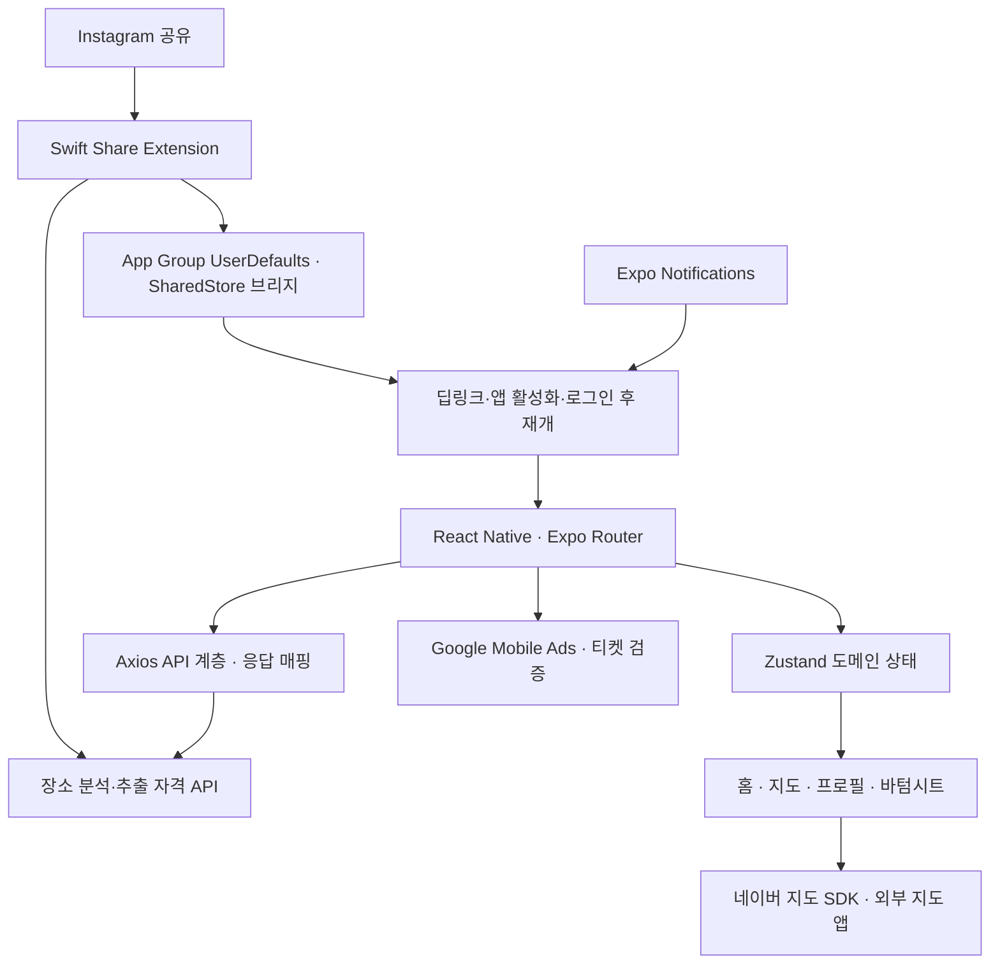

# SPOT — 발견한 장소를 저장하고, 친구의 취향으로 탐색하는 앱

> Instagram에서 발견한 장소와 친구가 저장한 장소를 내 지도에 모으는 소셜 장소 탐색 서비스.

이 문서는 SPOT **프로젝트 전체**를 소개하기 위한 포트폴리오·이력서 작성 자료다. 2026-09-09의 모바일 저장소를 근거로 작성했다. 문제 정의와 의의는 구현된 사용자 흐름을 바탕으로 정리한 설명이며, 사용자 조사 결과를 뜻하지 않는다. 개발 기간·팀 구성·담당 범위·심사 상태는 프로젝트 담당자가 제공한 정보를 반영했다. 사용자·매출 등의 운영 성과는 아직 확인되지 않았다.

| 항목 | 내용 |
| --- | --- |
| 개발 기간 | 약 1년 |
| 팀 구성 | 6명: 기획 2명 · 디자인 1명 · 백엔드 2명 · 프론트엔드 1명 |
| 담당 역할 | 모바일 프론트엔드 단독 구현 |
| 현재 상태 | App Store 배포 심사 중 — 2026-09-09 사용자 확인 |
| 주요 기술 | React Native · Expo · TypeScript · Zustand · Swift · Naver Map SDK |

## 1. 프로젝트 소개

SPOT은 Instagram 게시물에서 발견한 장소를 저장하고, 나와 친구가 저장한 장소를 지도와 목록으로 탐색하는 모바일 앱이다. 외부 콘텐츠에서 장소를 발견하는 순간부터 앱 안에서 저장하고 다시 찾는 과정까지 연결한다.

사용자는 Instagram의 공유 기능으로 SPOT에 게시물 URL을 전달한다. 서버의 장소 분석 결과에서 원하는 장소를 골라 저장하고, 이후 지도에서 위치를 확인하거나 거리·업종·저장 방식으로 목록을 좁힐 수 있다. 친구를 팔로우하면 친구 전체 또는 특정 친구가 저장한 장소를 살펴보고 자신의 장소 목록에 추가할 수 있다.

기술적으로는 React Native 화면 구현에 더해 **Swift 기반 iOS Share Extension, 앱 간 데이터 전달, 로그인 후 작업 재개, 서버 검증을 기다리는 광고 보상, 푸시 알림의 목적지 이동**을 연결한 프로젝트다.

## 2. 해결하려는 문제와 의의

| 사용자가 겪을 수 있는 문제 | SPOT의 접근 | 제품에서 제공하려는 가치 |
| --- | --- | --- |
| SNS에 저장한 게시물을 실제 장소 정보로 다시 찾기 번거롭다 | 게시물 공유 → 장소 분석 API → 장소 선택·저장 | 콘텐츠로 발견한 관심을 지도에서 다시 찾을 수 있는 장소로 연결 |
| 관심 장소가 여러 게시물에 흩어져 있다 | 저장한 장소의 지도 핀·목록·필터 제공 | 위치와 방문 목적을 기준으로 관심 장소 재탐색 |
| 누구의 추천인지, 어떤 취향의 장소인지 알고 싶다 | 친구 전체·나·특정 친구의 저장 장소 탐색 | 사람의 취향과 관계를 장소 발견의 맥락으로 활용 |
| 로그인이나 광고 확인 때문에 저장 흐름이 중간에 끊긴다 | 미완료 URL·티켓 보존 및 앱 복귀 후 재개 | 사용자가 시작한 작업을 다음 화면에서도 이어가도록 설계 |
| 추출된 장소가 잘못됐을 때 설명을 처음부터 해야 한다 | 원본 게시물 URL을 포함한 문의 접수 | 문제가 발생한 콘텐츠와 사용자 문의를 연결 |

포트폴리오에서 가장 강조할 의의는 **“SNS에서의 발견, 지인 기반 탐색, 개인 장소 저장을 하나의 사용 흐름으로 연결했다”**는 점이다. 저장 시간 단축이나 방문 전환율 향상은 앞으로 사용자 데이터를 통해 확인할 제품 가설이다.

## 3. 핵심 기능

### A. Instagram 공유로 장소 저장

- iOS 공유 확장에서 URL 또는 텍스트에 포함된 링크를 읽는다.
- 추출 가능 여부를 확인한 뒤 장소 분석 API를 호출한다.
- 분석 결과의 이름·주소·사진을 장소 선택 화면으로 변환한다.
- 결과 묶음별 선택 상태와 원본 URL을 관리하고, 여러 묶음에서 선택한 장소를 한 번에 저장한다.
- 로그인되지 않았거나 토큰이 만료된 경우 미완료 URL을 보존해 앱에서 이어갈 수 있도록 처리한다.

**어필 포인트:** 외부 앱에서 시작한 작업을 네이티브 공유 확장과 React Native 앱을 거쳐 완료하는 기능을 구성했다.

근거: [공유 확장](../ios/SpotShare/ShareViewController.swift), [앱 진입·재개](../app/_layout.tsx), [결과 수신](../app/analyze-result.tsx), [결과 묶음 상태](../src/stores/useAnalyzeResultStore.ts), [선택·저장 화면](../src/components/bottomSheet/SavePlacesBottomSheet.tsx).

### B. 지도와 목록을 연결한 장소 탐색

- 네이버 지도에서 저장 장소와 검색 결과를 핀으로 표시한다.
- 핀이나 검색 결과를 누르면 카메라 이동과 상세 바텀시트를 연결한다.
- 현재 위치와 장소 좌표를 이용해 거리를 계산하고 표시한다.
- 저장한 장소·인기 장소를 조회하고 업종·거리·저장 방식에 따라 탐색한다. 제공되는 필터는 목록 종류에 따라 다르다.
- 장소 상세에서 사진, 주소, 매장 위치, 저장한 사용자 정보를 확인하고 네이버 지도 앱으로 연결한다.

**어필 포인트:** 검색 결과·지도 선택·상세 정보·북마크를 개별 화면에 흩어두지 않고 하나의 탐색 과정으로 연결했다.

근거: [지도 화면](../app/(tabs)/map.tsx), [장소 검색](../app/searchPlace.tsx), [장소 상세](../app/place/[placeId].tsx), [검색 상태](../src/stores/useSearchStore.ts), [거리 계산](../src/utils/distance.ts).

### C. 친구의 취향으로 장소 발견

- 별명 또는 SPOT ID로 사용자를 검색하고 최근 검색을 제공한다.
- 팔로우 요청·수락·관계 해제, 차단·차단 해제, 신고를 처리한다.
- 홈에서 친구 전체·나·특정 친구라는 3가지 범위를 선택해 장소를 살펴본다.
- 친구가 저장한 장소를 자신의 목록에도 저장하고, 저장 요청에 친구 프로필 등 유입 맥락을 함께 전달한다.
- 친구 관계 변경을 검색 결과·친구 목록·홈·알림 화면에 반영한다.

**어필 포인트:** 관계 상태에 따른 행동과 콘텐츠 조회 범위를 함께 설계한 소셜 기능이다. 단순한 친구 목록 표시보다 상태 전이와 화면 간 동기화가 설명할 만한 부분이다.

근거: [친구 검색·액션](../app/searchFriends.tsx), [관계 상태 매핑](../src/lib/friends/friendStatus.ts), [친구 스토어](../src/stores/useFriendsStore.ts), [홈](../app/(tabs)/index.tsx), [친구 홈 이동](../src/lib/navigation/openFriendHome.ts).

### D. 장소 추출 흐름에 연결한 광고 보상

- 서버의 추출 자격 응답에 따라 무료 분석과 광고 필요 경로를 나눈다.
- 광고 요청에 티켓 ID를 서버 검증용 데이터로 전달한다.
- 광고 시청 완료 후 서버의 티켓 상태가 검증됐는지 확인하고 분석을 재개한다.
- 광고 미완료·티켓 만료·검증 지연을 구분해 처리한다.
- 보상형 전면 광고 외에 장소 목록의 네이티브 광고와 프로필 배너도 구성한다.

**어필 포인트:** 광고 표시와 핵심 기능 사용 권한을 연결하고, SDK 이벤트와 서버 상태의 시간차를 처리했다. 수익화 기능의 클라이언트 구현 사례로 설명할 수 있다.

근거: [보상 흐름](../src/components/ads/AnalyzeRewardGateModal.tsx), [광고 SDK 이벤트](../src/lib/ads/rewardedInterstitialAd.ts), [서버 검증 옵션](../src/lib/ads/rewardedInterstitialOptions.ts), [광고 배치](../src/lib/ads/insertAdSlots.ts).

### E. 알림으로 작업과 관계 이어가기

- Instagram 추출·팔로우 요청·팔로우 수락이라는 3가지 구현 알림 타입을 다룬다.
- 알림 목록·읽음 처리·읽지 않은 알림 수를 제공한다.
- 알림 선택 시 장소 정보나 추출 결과 선택 흐름으로 이동한다.
- 알림 화면에서 관계를 확인하고 팔로우 관련 액션을 실행한다.
- iOS 푸시 권한·사용자 설정·토큰 등록 및 비활성화, 앱 재활성화 시 동기화를 처리한다.

**어필 포인트:** 푸시 수신에서 끝나지 않고 알림의 대상 데이터와 실제 행동 화면을 연결했다.

근거: [푸시 생명주기](../src/hooks/useRegisterPushToken.ts), [알림 목록](../app/profile/notifications.tsx), [알림 대상 이동](../src/lib/navigation/openNotificationTarget.ts), [알림 타입](../src/lib/api/notification.ts).

### F. 계정과 운영 기능

- Kakao OAuth 및 Apple 로그인 연동.
- 프로필 사진 촬영·선택, 별명·소개 수정, SPOT ID 규칙 및 중복 확인.
- 로그아웃·회원 탈퇴와 푸시 토큰 비활성화.
- 장소 추출·장소 상세·일반 문의의 3가지 문의 맥락 지원.
- 공유 확장에서도 원본 URL을 첨부해 추출 문제 문의 가능.

**어필 포인트:** 핵심 시연 기능 외에 인증, 계정 관리, 신고, 문의 등 서비스 사용 전후의 기능도 포함했다.

근거: [로그인](../app/login.tsx), [프로필 편집](../app/profile/edit.tsx), [계정 설정](../app/profile/accountSetting.tsx), [문의 API](../src/lib/api/inquiry.ts), [앱 문의 시트](../src/components/inquiry/InquiryBottomSheet.tsx).

## 4. 대표 사용자 시나리오

### 시나리오 1 — Instagram에서 발견한 카페 저장

1. Instagram 게시물에서 공유 메뉴를 열고 SPOT을 선택한다.
2. 공유 확장이 URL을 읽고 서버에 추출 가능 여부를 요청한다.
3. 필요한 경우 앱 로그인 또는 광고 시청으로 이어진다.
4. 분석 결과에서 원하는 장소를 선택해 저장한다.
5. 저장한 장소를 지도에서 다시 확인하고 네이버 지도 앱으로 이동한다.

### 시나리오 2 — 친구의 저장 장소에서 방문 후보 찾기

1. 친구를 검색하고 팔로우 관계를 맺는다.
2. 홈에서 특정 친구를 선택한다.
3. 지도 또는 장소 목록으로 친구가 저장한 장소를 탐색한다.
4. 업종·거리 정보를 확인해 자신의 관심 장소로 저장한다.

데모 영상은 이 두 시나리오를 우선 보여주고, 미로그인 공유 후 재개나 광고 보상 경로를 기술 설명용 보조 장면으로 넣으면 프로젝트의 특징이 잘 드러난다.

## 5. 구조와 기술 선택

| 영역 | 사용 기술 | 코드에서 확인되는 역할 |
| --- | --- | --- |
| 앱 | React Native 0.79 · Expo SDK 53 · React 19 | 모바일 화면 및 네이티브 모듈 통합 |
| 언어·탐색 | TypeScript · Expo Router | 화면 라우팅, route parameter와 도메인 타입 |
| 상태 | Zustand | 인증·위치·친구·검색·저장 장소·분석 결과 상태 관리 |
| 네트워크 | Axios | 3개 API 클라이언트, 인증 헤더 및 401 공통 처리 |
| 지도 | react-native-naver-map · expo-location | 핀, 카메라, 위치 구독, 현재 위치 |
| 공유 확장 | Swift · UIKit · Objective-C 브리지 | URL 수신, 공유 저장소, 앱으로 결과 전달 |
| 인터랙션 | Gorhom Bottom Sheet · Gesture Handler · Animated/Reanimated | 지도 위 시트와 스크롤 상호작용 |
| 인증·저장 | WebBrowser AuthSession · Apple Authentication · AsyncStorage | 로그인 세션 교환·복원, 네이티브 확장과 토큰 전달 |
| 광고·알림 | Google Mobile Ads · Expo Notifications | 광고 보상과 푸시 처리 |
| 빌드 | EAS 설정 | development·preview·testflight-review·production 프로필 |

의존성 목록에 있는 기술을 모두 실제 사용 기술로 나열하지 않고, 기능과 연결된 기술을 중심으로 정리했다. 3개 API 클라이언트가 있다는 사실만으로 백엔드를 마이크로서비스 아키텍처라고 설명할 수는 없다.

## 6. 기술적으로 깊게 설명할 만한 사례

### 사례 1. 서로 다른 실행 환경 사이에서 장소 저장 이어가기

**상황:** 장소 공유는 외부 앱과 iOS 확장에서 시작하지만, 로그인·광고·최종 장소 선택은 React Native 앱에서 수행한다. 앱이 이미 실행 중인지, 처음 실행되는지에 따라서도 진입 이벤트가 달라진다.

**구현:** App Group 저장소에 분석 결과와 미완료 URL·티켓을 보관하고 Swift 브리지로 읽는다. 딥링크의 최초 URL 및 실행 중 URL 이벤트를 처리하며, 앱 활성화 시 완료 결과가 남아 있는지도 확인한다. 앱 상태 복원 이후 재개하도록 순서를 조정하고 진행 중인 재개 작업은 Promise 참조로 중복 실행을 막는다.

**설명할 역량:** 네이티브 연동, 앱 생명주기, 인증에 의해 중단된 작업의 재개, 비동기 이벤트 조율.

### 사례 2. 연속 공유 결과를 묶음으로 관리

**상황:** 사용자가 여러 게시물을 연속 공유하면 하나의 결과 변수만으로는 이전 결과나 선택 상태를 유지하기 어렵다.

**구현:** 공유 저장소는 분석 결과를 배열 큐에 추가한다. 앱은 결과를 읽어 각 묶음에 ID·원본 URL·수신 시각·선택한 장소 ID를 부여한다. 이전/다음 묶음을 오가며 선택하고 여러 묶음의 선택을 모아 저장한다. 네이티브 큐를 읽는 반복에는 1회 소비 작업당 100회 상한을 두었다.

**설명할 역량:** 데이터 모델링, 큐 소비, 복수 작업의 선택 상태 보존. “100건 동시 처리 성능”으로 표현하지 않고 비정상 반복 방지 상한이라고 설명한다. 앱에서 이미 읽은 미저장 선택 상태까지 재시작 후 영구 복구한다고 주장하지 않는다.

### 사례 3. 광고 이벤트와 서버 검증의 시간차 처리

**상황:** 광고 SDK에서 시청 완료 이벤트가 발생한 시점과 서버가 티켓을 검증한 시점은 다를 수 있다.

**구현:** 광고 요청의 `customData`로 티켓을 전달하고, 시청 완료 후 상태 API를 최대 10회 조회한다. 검증 완료 시 분석을 재개하고, 만료·실패·지연은 별도 상태로 처리한다. 개발 모드에는 강제 검증 경로를 분리한다.

**설명할 역량:** 외부 SDK 통합, 서버 상태 확인, 제한된 재시도, 실패와 정상 종료의 구분. 서버 검증 자체의 구현은 이 저장소의 기여 범위로 단정하지 않는다.

### 사례 4. 친구 관계 변경과 여러 화면의 동기화

**상황:** 같은 사용자와의 관계가 검색·친구 목록·알림·홈에 동시에 나타난다. 요청 수락이나 삭제 중에도 이전 조회가 끝날 수 있다.

**구현:** 서버의 incoming/outgoing 및 차단 상태를 화면 행동 상태로 변환한다. 친구 스토어는 변경 revision과 후속 새로고침 여부를 관리한다. 알림 화면은 동일 사용자 액션의 중복 실행을 막고, 이미 처리된 요청 등의 응답에서는 관계를 다시 조회해 화면을 맞춘다.

**설명할 역량:** 도메인 상태 전이, 낙관적 갱신과 복구, 화면 간 상태 공유.

### 보조 사례. 데이터 처리 효율 개선

동시 요청 공유, 변경 없는 북마크의 참조 유지, 검색 취소 및 최근 응답만 반영하는 처리를 적용했다. 이 사례의 전후 수치와 재현 조건은 [성능 개선 기술 기록](optimization-portfolio.md)에 별도 보관했다. 프로젝트 소개의 주제는 전체 제품이며, 성능 개선은 기술적 보완 사례다.

## 7. 수치로 표현할 수 있는 구현 범위

아래 값은 사용자 성과 지표가 아니라 **코드에 정의된 기능·구조의 범위**다.

| 수치 | 의미 | 근거 |
| --- | --- | --- |
| 주요 탭 3개 | 홈·지도·프로필 | `app/(tabs)/_layout.tsx` |
| 홈 탐색 범위 3개 | 친구 전체·나·특정 친구 | `HomeScope` |
| 홈 표시 방식 2개 | 지도·장소 목록 | `HOME_TABS` |
| 로그인 방식 2개 | Kakao·Apple | `app/login.tsx` |
| 관계 표시 상태 5개 | 없음·친구·요청 보냄·요청 받음·차단 | `FriendStatus` |
| 구현 알림 타입 3개 | 추출·팔로우 요청·팔로우 수락 | `IMPLEMENTED_NOTIFICATION_TYPES` |
| 광고 형식 3개 | 보상형 전면·네이티브·배너 | `src/components/ads`, `src/lib/ads` |
| 문의 맥락 3개 | 추출·상세·일반 | `InquiryCategory` |
| 검색 디바운스 400ms | 장소·친구 검색 입력 대기 설정 | `app/searchPlace.tsx`, `app/searchFriends.tsx` |

이력서에는 숫자를 전부 나열하기보다 “2종 로그인과 iOS 공유 확장을 연결해 외부 콘텐츠 저장 흐름 구성”처럼 기술적 의미와 함께 사용한다.

## 8. 바로 사용할 수 있는 소개 문장

### 한 줄 소개

**SPOT | Instagram에서 발견한 장소와 친구의 저장 장소를 지도에 모으는 소셜 장소 탐색 앱**

### 포트폴리오 요약

SPOT은 약 1년간 6인 팀에서 진행하며 모바일 프론트엔드를 단독 구현한 프로젝트로, 현재 App Store 심사 중입니다. SNS에서 발견한 장소를 실제 방문 후보로 관리하고 친구의 취향을 통해 새로운 장소를 발견하도록 만들었습니다. Instagram 공유에서 시작한 장소 분석 결과를 선택·저장하고, 지도와 목록에서 나와 친구의 저장 장소를 탐색할 수 있습니다. React Native·Expo 기반 앱에 Swift 공유 확장과 App Group 브리지를 연결했으며, 로그인 후 작업 재개, 복수 분석 결과 관리, 서버 검증 기반 광고 보상, 알림 대상 이동까지 사용자 흐름을 구성했습니다.

### 이력서용 프로젝트 항목

**SPOT — 소셜 장소 저장·탐색 앱**
기간: 약 1년 · 6인 팀 · 모바일 프론트엔드 단독 구현 · App Store 심사 중
기술: React Native, Expo, TypeScript, Zustand, Swift, Naver Map SDK

- 기획 2명·디자인 1명·백엔드 2명과 협업하며 React Native 모바일 프론트엔드를 단독 구현하고 App Store 심사 단계까지 진행.
- Instagram 공유 URL에서 장소 분석·선택·저장으로 이어지는 기능과 친구 기반 지도 탐색 구현.
- Swift Share Extension·App Group·React Native 브리지를 연동하고 미완료 URL 및 분석 결과를 전달해 로그인 후 저장 작업을 이어가는 흐름 구성.
- 친구 전체·나·특정 친구의 3가지 탐색 범위와 지도·목록 전환을 제공하고, 검색·북마크·관계 변경 상태를 연결.
- 광고 티켓의 서버 검증을 확인한 뒤 장소 분석을 재개하는 보상 흐름과 iOS 푸시 알림의 목적지 이동 구현.

지원 직무와 이력서 분량에 맞춰 위 항목 중 3~4개를 선택한다. 프론트엔드 단독 구현은 팀 프로젝트 내 담당 범위를 뜻하며, 기획·디자인·백엔드까지 혼자 개발했다는 표현은 사용하지 않는다. 서버 연동은 클라이언트의 API 요청·응답 처리 범위로 설명한다.

### 1분 설명

“SPOT은 약 1년간 진행한 6인 팀 프로젝트로, 저는 모바일 프론트엔드를 단독 구현했습니다. 현재 App Store 심사 중입니다. Instagram에서 발견한 장소와 친구가 저장한 장소를 내 지도에 모으는 앱입니다. SNS에 저장한 게시물을 나중에 장소 기준으로 다시 찾기 번거롭다는 문제에 접근했습니다. 게시물을 공유하면 분석 결과에서 장소를 선택해 저장하고, 친구 전체나 특정 친구의 장소도 지도와 목록으로 살펴볼 수 있습니다. 기술적으로 중요한 부분은 외부 앱의 공유 확장, 로그인, 광고 보상, 최종 저장이 서로 다른 실행 환경과 비동기 작업이라는 점입니다. Swift 공유 확장과 App Group 브리지로 결과와 미완료 작업을 전달하고, 앱에서 이를 이어서 처리하도록 구현했습니다.”

## 9. 코드에서 확인한 현재 범위

| 구분 | 현재 설명 가능한 범위 |
| --- | --- |
| 장소 분석 | 모바일의 분석 API 연동과 결과 처리 확인. 분석 모델·크롤링·정확도·서버 구현은 이 저장소로 확인할 수 없음 |
| iOS·Android | React Native 및 양쪽 네이티브 프로젝트 존재. 공유 확장, 현재 푸시 등록과 광고의 주요 실행 경로는 iOS 중심. 양 플랫폼 기능 동등성은 주장하지 않음 |
| 리뷰·코멘트 | 컴포넌트와 API 코드는 있으나 홈 코멘트 탭 및 상세의 작성·목록 UI가 주석 처리됨. 현재 핵심 제공 기능에 포함하지 않음 |
| 알림 | 구현 타입 3개와 예정 타입 9개가 구분됨. 예정 알림까지 운영 중이라고 소개하지 않음 |
| 배포 | App Store 심사 중으로 사용자 확인. EAS 빌드 프로필 존재. 심사 통과·정식 출시 완료로 표현하지 않음 |
| 성과 | 다운로드·활성 사용자·추출 성공률·광고 매출·리텐션은 확인되지 않음 |

## 10. 제출 전 보충할 정보와 증거

| 항목 | 추가할 내용 |
| --- | --- |
| 개발 배경 | 실제로 겪은 문제, 서비스 기획 계기, 사용자 피드백 |
| 정확한 기간 | 약 1년이라는 기간을 실제 시작 월~현재/종료 월로 구체화 |
| 개인 기여 증거 | 프론트엔드 단독 구현을 보여주는 대표 PR·커밋·설계 기록 |
| 출시 | 심사 통과 후 App Store 링크·실제 출시일·검증 기기 추가 |
| 데모 | 공유→저장, 친구→장소 탐색 두 흐름의 영상 또는 스크린샷 |
| 제품 지표 | 측정 기간을 포함한 사용자 수, 장소 저장 수, 추출 요청·성공 수 |
| 배운 점 | 가장 어려웠던 실제 문제, 선택한 해결책, 트레이드오프 |

운영 데이터를 확보하면 다음 지표를 추가할 수 있다: 추출 성공률(성공/전체 요청), 결과 확인 후 저장 전환율(저장 완료 세션/결과 노출 세션), 친구 장소 저장 비율, 재방문율. 현재 수치가 없으므로 이 문서에는 결과값을 넣지 않았다.
